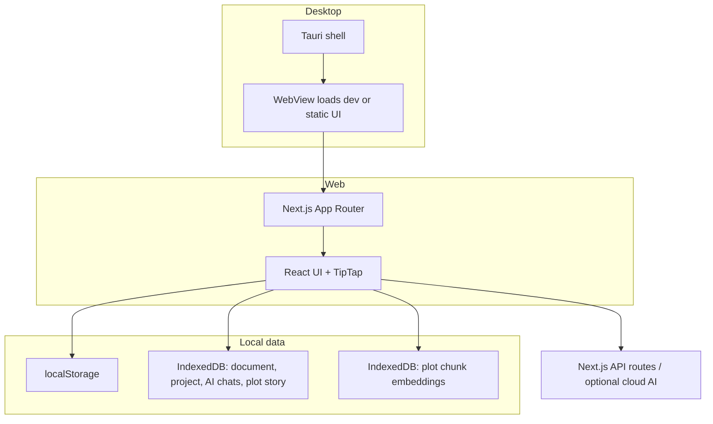

# Architecture overview

High-level map of how Tanym is structured at runtime. For setup and commands,
see [README.md](../README.md) and [DEVELOPMENT.md](DEVELOPMENT.md).

## Runtime surfaces

## Major subsystems

| Area | Role |
|------|------|
| **Story project** | `StoryProject` (chapters → scenes → character cards) is the semantic model; see `src/lib/project/`. |
| **Editor** | TipTap / ProseMirror extensions under `src/components/Editor/`; persistence via `src/lib/doc-persistence.ts`. |
| **Layout** | Page/reflow pipeline in `src/lib/page-layout-engine/` and `src/lib/layout/`; heavy work stays off the main thread where possible. |
| **AI assistant** | Client tools + API routes under `src/app/api/ai/`; providers in `src/lib/ai/`. Optional **Ollama** for offline. |
| **Plot memory** | Plot story store + embeddings index (`src/lib/plot-index/`, `src/stores/plotStoryStore.ts`). |
| **Tauri** | Native file dialogs, filesystem access, optional updater hooks — `src-tauri/`. |

## Data flow (simplified)

1. User edits a **scene** in TipTap → Zustand `projectStore` / `documentStore` update.
2. Autosave persists project JSON to **localStorage or IndexedDB** (size-dependent).
3. Background analysis may call **embeddings / extract** APIs (local or remote).
4. **Plot index** stores vectors in a dedicated IndexedDB database for semantic search and continuity checks.

## Security boundaries

- **API keys** for cloud models live in `.env.local` on the dev machine or in user settings for packaged apps — not in the repo.
- **Tauri** capabilities gate filesystem and dialog access (`src-tauri/capabilities/`).
- **CSP** and `allowedDevOrigins` are configured for safe local/LAN dev with Next.js.

## Where to change things

| Goal | Start here |
|------|------------|
| New ribbon / shell UI | `src/components/Ribbon/`, `src/components/Shell/` |
| Editor marks / commands | `src/components/Editor/extensions.ts` and `extensions/` |
| AI tool or prompt | `src/lib/ai/tools.ts`, `src/lib/ai/system-prompt.ts`, matching route in `src/app/api/ai/` |
| Export / DOCX | `src/lib/file-io.ts`, `src/lib/save-docx-workflow.ts` |
| Desktop packaging | `src-tauri/tauri.conf.json`, `docs/DISTRIBUTION.md` |
